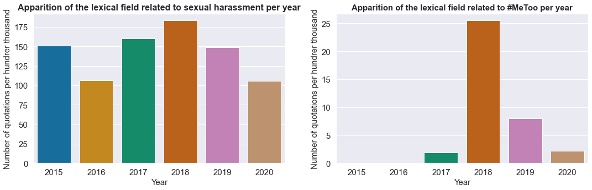
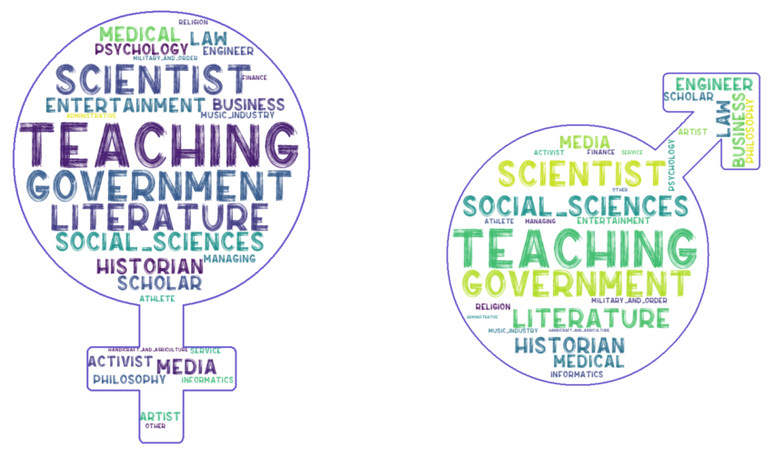
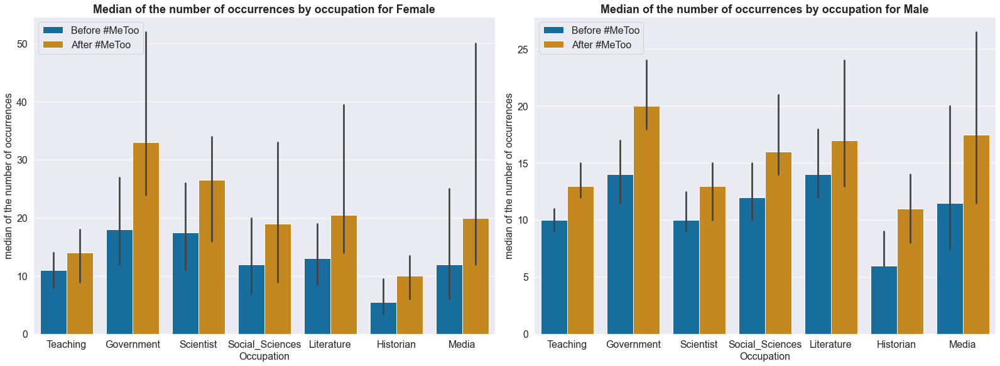

# A few data on women's mis-representation in the media

 In <strong>2015</strong>, the Global Media Monitoring Project (GMMP) conducted the largest <a href="https://www.media-diversity.org/additional-files/Who_Makes_the_News_-_Global_Media_Monitoring_Project.pdf">study</a> of women's image, participation and representation in the news media over 20 years and 114 countries. To give an overview on the matter of the significance of women's misrepresentation in the media before 2017, here are some data from this study: 

 
- Women made up **24%** of the people in newspaper, television, and radio news
- Women made up **20%** of expert featured in TV news
- Women made up **37%** of journalists telling stories around the world
- Women were the subject of political and governmental coverage **16%** of the time
 

  
 
This image of a gendered society reported by the every media can reinforce and perpetuate harmful gender stereotypes. Maybe the MeToo movement had a positive impact on this challenge ?... 

# **Table of Contents**
1. [Context](#context)
2. [The Quotebank Dataset](#quotebank)
3. [Descriptive Analysis](#descriptive)
4. [Matched Observational Study](#obsstudy)
5. [First Question of the Study](#first)
6. [Second Question of the Study](#second)

#  **Context**: The #MeToo movement 

 In 2006, Tarana Burke, activist and sexual assault survivor, creates the MeToo movement in support to all women victims of crimes of sexual nature. It is only in October 2017, when more than 80 women in the film industry made sexual abuse allegations against film producer Harvey Weinstein, that the MeToo movement re-emerged. The actress Alyssa Milano is the one who reignited the movement by encouraging victims of sexual harassment and assault to come forward using the hashtag #MeToo as a status update on Twitter. With the goal of raising awareness of sexual misconduct, empowering survivors to speak out, helping them heal as a community by not feeling alone in this battle, and bringing them justice, the MeToo movement has spread around the world, showing the reality and magnitude of sexual abuse against women.  

 

The reappearance of this movement can be seen in the newspapers. Indeed, when one analyses the lexical field of thousands of citations from English articles, coming from the <a href="#quotebank">Quotebank Dataset</a>), the rise of #MeToo and the Harvey Weinstein scandal is clearly marked temporally in the two graphs below. The frequency of quoted words related to sexual harassment (sexual harassment, sexual assault, rape, sexual touching) and any references to the #MeToo movement are respectively represented on the left and right figure. Each shows a marked peak of higher frequency in the year 2017 relating the importance that the movement took that year in the newspapers.
 

 

 

 In addition to the movement's instantaneous but temporary effect that can be seen on these graphs, in the long term its beneficial effect is much more profound. Indeed, by inviting thousands of women to come out of the shadows, to protest against such violence, to make themselves heard and to demand justice, these survivors have given the movement an even more important dimension in the fight for gender equality. Indeed, they have empowered the voices of women all around the world.  

  

<strong>It is hoped to find in this analysis, that this empowerment will reverberate through to the newspapers, where women's voices would be better heard, represented, diversified and accepted.</strong>  

#  **The Quotebank Dataset**: A goldmine of information on the role of women in the media

 178 million quotations along with its speakers extracted from hundreds of english articles from 2015 to 2020 together in one open corpus; that's the <a name="qtdata" href="https://dlab.epfl.ch/people/west/pub/Vaucher-Spitz-Catasta-West_WSDM-21.pdf">QuoteBank Dataset</a>. For a more thorough analysis, additional information about the speakers from the dataset need to be collected. Thus, thanks to an additional speaker metadata available for ~9M speakers (<a href="https://www.wikidata.org/wiki/Wikidata:Main_Page">Wikidata</a>), several attributes were added to the Quotebank dataset to make it more complete: the gender, the date of birth, the academic degree, and finally the speaker's occupations. From here, we have at our disposal a goldmine of information on the subjects, personnalities, genders, careers etcetera represented in the newspaper and displayed to a target audience in the last five years. Nevertheless, the dataset being too important and full of unknown speaker caracteritsics, data processing has been done retrieving only speakers with male or female genders, known ages, academic degrees and occupations for a much more relevant and reliable dataset applicable to <a href="#obsstudy">matched observational studies</a>. A typical line from our edited dataset gives the following informations:

 
 
  
 

<i>"At this moment the women of Time's Up and #metoo are looking and saying, why don't we have more stories and why is it that if we see these perversions at the end of the line, why aren't we fixing it at the beginning of the line?"</i>

 
<table>
  <tr>
    <td style="background-color: LavenderBlush">Speaker</td>
    <td style="background-color: LavenderBlush">Speaker's Wikidata ID</td>
    <td style="background-color: LavenderBlush">Speaker's gender</td>
    <td style="background-color: LavenderBlush">Speaker's age</td>
  </tr>
  <tr>
    <td>Eric Garcetti</td>
    <td><a href="https://www.wikidata.org/wiki/Q5386557">Q5386557</a></td>
    <td>Male</td>
    <td>47</td>
  </tr>
  <tr>
    <td style="background-color: LavenderBlush">Speaker's occupations</td>
    <td style="background-color: LavenderBlush">Speaker's academic degree</td>
    <td style="background-color: LavenderBlush">Quotation's number of occurences</td>
    <td style="background-color: LavenderBlush">Newspaper's year release</td>
  </tr>
  <tr>
    <td>[politician, actor, television actor...]</td>
    <td>[Bachelor of Arts, Master of International Affairs...]</td>
    <td>3</td>
    <td>2018</td>
  </tr>
</table>
 
 

#  **Descriptitve analysis**: An overview of the dataset

The dataset, as said before, was reduced to have an optimal analysis. Let's take a look at what it contains keeping in mind the two pillar questions around which this study is conducted:

Do women speak more in general after the movement?

Has the representation of women's occupations changed after #MeToo?

 

{% include imagetextright.html figname="Percentage_of_quotations_by_gender_and_by_period.html" title="Counting the quotes published for each gender" description="> The voice in the newspapers is much more given to men than to women (about 80% against 20%) which is similar to the figures published in 2015. A slight evolution of the rate of women's speech appears between the periods but it remains to be investigated." %}

{% include imagetextleft.html image_path="D-perc-quot-genders-period.png" title="Counting the quotes published for each gender" description=">The voice in the newspapers is much more given to men than to women (about 80% against 20%) which is similar to the figures published in 2015. A slight evolution of the rate of women's speech appears between the periods but it remains to be investigated." %}  

 

  

 

After this short description of the dataset, let's get down to business!

#  **Matched Observational Study**: The ideal setting to a causal analysis

 Let's recall the problematic around the analysis: 

 
  
 
 
<i>Has the MeToo movement affected the representation of women in the newspapers?</i>

 
  
 

Since the quotebank dataset is a found dataset, and not a created experiment, it is appropriate to call its analysis an observational study. With the reduced dataset containing only speakers with enough known characteristics, the following analysis is conducted: a <strong>matched observational study</strong>. This means that the dataset is reduced and cut in two in a way that for every speaker of a certain gender quoted before #MeToo thus belonging to the before #MeToo dataset (i.e., before October 2017), a very similar speaker (or the same one if this one is quoted after MeToo) of the same gender belongs to the new dataset of after #MeToo quotes. Similarity is measured by the degree of similitude of the features obtained on the speakers. Any pre #MeToo speaker that is not paired with a post #MeToo counterpart (and vice versa) is thus removed from the dataset. Therefore, the 'before' dataset contains speakers extremely similar the the 'after' dataset i.e. the speakers have the same characteristics. The two new datasets can be approximated to be the same in term of the speakers each contains and thus can be properly compared with no risk of confounders interfering with the causality.

#  **First Question of the Study**: Do women speak more in general after the movement?

Previously, it was observed that significantly more men were quoted at any period of time. However, the graph below shows when the median number of quotes said per person is counted, women dominate, both before and after #MeToo with an intensification of the male-female difference after the movement. Nevertheless, this increase is a general trend that can be found for both genders and nothing can be concluded about the role played by the movement in favor of this female rule. So while few women are quoted compared to men, those who are will be listened to much more than the average man quoted. What prevails is the idea that a woman must be much more important and listened to in order to appear in the newspapers.



Moreover, after some statistical test (<a href="https://statistics.laerd.com/spss-tutorials/wilcoxon-signed-rank-test-using-spss-statistics.php">wilcoxon signed rank test</a>) it was found that for any pairing of speakers before and after the movement, the probability of a speaker after #MeToo to have more quotes published than the speaker before #MeToo is of 0.56 for male and 0.57 for female. Thus, it can be concluded that, in general, speakers after the movement speak more than speakers before. However, even if this phenomenon seems to be a little bit more pronounced for women, the same trend is followed by both genders, with small effects. It is possible that this analysis is too general, so we decided to focus only on certain occupations for the rest of the analysis. Thus, we will analyze if the profile of the female speakers has changed i.e. whether the professions represented have differed post-Metoo, and once again we will compare this evolution with male speakers.

#  **Second Question of the Study**: Has the representation of women's occupations changed after #MeToo?

## Professions representation in the matched observational sutdy dataset

An important feature that was added to the dataset are the occupation categories. Since there were over 900 occupations in the dataset, we created 40 categories to group them together and allow for a simplified assessment of the representation of occupations in the journals. For example, a person with the category "Teaching & Education" could be an academic administrator, a teacher, a Ph.D. student, a faculty member, a guidance counselor etc. With the balanced dataset, a lot of speakers have been removed and the ones remaining have the same characteristics before and after #MeToo in the globality. Thus the following graph shows the male and female's categories of occupations displayed in the balanced datased both before and after #MeToo as they coincide in terms of charatceristics. The size of the font is proportional to the frequency with which the category appears.

The most represented occupations are quite similar for the men and women, before and after metoo. However, what this graph doesn't show are the proportions. Keep in mind that proportionally speaking, men's occupations represent 80% of the dataset and women's only 20%. A PARTIR DE MAINTENANT ON SE FOCUS QUE SUR 8 OCCUPATIONS LSE PLUS REPRÉSENTE REGARDER JEANNETTE ET PROPORTION MALE FEMALE.

## Targeted matching according to occupations

Here again, the dataset is reduced and cut in two in a way that for every speaker of a certain gender and a given category of occupation quoted before #MeToo, a very similar speaker of the same gender and category of occupation belongs to the new dataset of after #MeToo quotes (for more technical see the <a href="https://github.com/epfl-ada/ada-2021-project-adamn">code</a> we did on the matching). It is now possible to analyse if some categories of occupations are more represented after #MeToo.

 

The graph below shows the median number of quotes said according to the gender and the category. We first observe a higher median for female than for male in most cases except for the Historian category. This could indicate that even if the number of male speakers is higher than the number of female speakers, in most cases a single female speaker will have more quotations occurrences than a man. Both male and female speakers show an increase in the median of the number of occurrences after #MeToo. However, this increase is larger for female for the following categories: Government, Scientist, Law, Social Sciences, Literature and Media. We could say that for the previous categories, even if the representation of both genders have increased after #MeToo, this increase is higher for females.

 

Further analysis is needed to assess this increase, because so far, with some exceptions, the representation of women does seem to have increased in this matched observational study. This increase is to be further investigated with the help of statistical tests.

