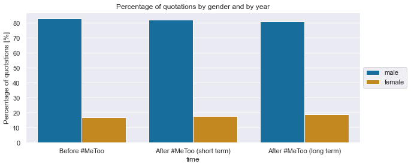
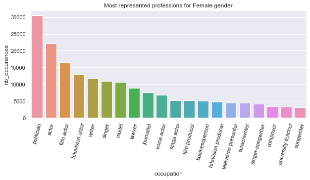
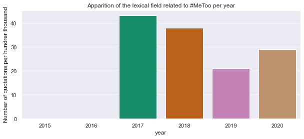
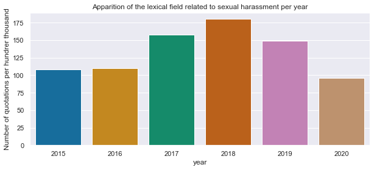
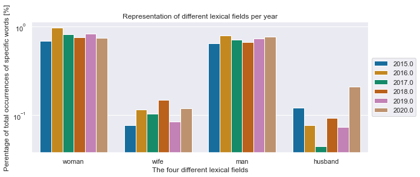

#  **Abstract**: A few data on women mis-representation in the media 

 In <strong>2015</strong>, the Global Media Monitoring Project (GMMP) conducted the largest <a href="https://www.media-diversity.org/additional-files/Who_Makes_the_News_-_Global_Media_Monitoring_Project.pdf">study</a> of women's image, participation and representation in the news media over 20 years and 114 countries. To give an overview on the matter of the significance of women's misrepresentation in the media before 2017, here are some data from this study: 

 
- Women made up **24%** of the people in newspaper, television, and radio news
- Women made up **20%** of expert featured in TV news
- Women made up **37%** of journalists telling stories around the world
- Women were the subject of political and governmental coverage **16%** of the time
 

  
 
This image of a gendered society reported by the every media can reinforce and perpetuate harmful gender stereotypes. Clearly, all media outlets need to change the way they reflect the world. Maybe the MeToo movement had a positive impact on this challenge ?... 

# **Table of Contents**
1. [Abstract](#abstract)
2. [Context](#context)
3. [The Quotebank Dataset](#quotebank)
4. [The Observational Study](#obsstudy)
5. [Descriptive Analysis](#descriptive)
6. [Matching analysis](#obs2)

#  **Context**: The #MeToo movement 

 In 2006, Tarana Burke, activist and sexual assault survivor, creates the MeToo movement in support to all women victims of crimes of sexual nature. It is only in October 2017, when more than 80 women in the film industry made sexual abuse allegations against film producer Harvey Weinstein, that the MeToo movement re-emerged. The actress Alyssa Milano is the one who reignited the movement by encouraging victims of sexual harassment and assault to come forward using the hashtag #MeToo as a status update on Twitter. With the goal of raising awareness of sexual misconduct, empowering survivors to speak out, helping them heal as a community by not feeling alone in this battle, and bringing them justice, the MeToo movement has spread around the world, showing the reality and magnitude of sexual abuse against women.  

 

Moreover, and most importantly, by inviting thousands of women to come out of the shadows, to protest against such violence, to make themselves heard and to demand justice, these survivors have given the movement an even more important dimension in the fight for gender equality. Indeed, they have empowered the voices of women all around the world.  

  

<strong>It is hoped to find in this analysis, that this empowerment will reverberate through to the newspapers, where women's voices would be better heard, represented, diversified and accepted.</strong>  

#  **The Quotebank Dataset**: A goldmine of information on the role of women in the media

 178 million quotations along with its speakers extracted from hundreds of english articles from 2015 to 2020 together in one open corpus; That's the <a name="qtdata" href="https://dlab.epfl.ch/people/west/pub/Vaucher-Spitz-Catasta-West_WSDM-21.pdf">QuoteBank Dataset</a>. A goldmine of information on the subjects, personnalities, ethnicities, genders, careers etcetera represented in the newspaper and displayed to a target audience in the last five years. Off the NUMBER of quotations and NUMBER of known speakers retrieved from the dataset, the analysis was conducted on NUMBER of quotations said by NUMBER of speakers. Indeed, the dataset being too important and full of unknown speaker caracteritsics, data processing has been done retrieving only speakers with known CECI et CELA for a much more relevant and reliable (valide, accurate, meaningful, trustworthy, faithful, credible, robust)  dataset applicable to a matched observational studies. 

#  **Matched Observational Study**: The ideal setting to a causal analysis

 Let's recall the problematic around the analysis: 

 
  
 
 
<i>Did the MeToo movement affect the representation of women in the newspapers?</i>

 
  
 

Since the quotebank dataset is a found dataset, and not a created experiment, it is appropriate to call its analysis an observational study. With the reduced dataset containing only speakers with enough known characteristics, the following two analysis are conducted. The first is only a <strong>description of the dataset</strong>. The second is a <strong>matched observational study</strong>. This means that the dataset is reduced and cut in two in a way that for every speaker quoted before #MeToo thus belonging to the before #MeToo dataset (i.e., before October 2017), a very similar speaker (or the same one if this one is quoted after MeToo) belongs to the new dataset of after #MeToo quotes. Similarity is measured by the degree of similitude of the features obtained on the speakers (SET CHARACTER). Any pre #MeToo speaker that is not paired with a post #MeToo counterpart (and vice versa) is thus removed from the dataset. Therefore, the 'before' dataset contains speakers extremely similar the the 'after' dataset i.e. the speakers have the same characteristics. The two new datsets can be approximated to be the same in term of the speakers it contains and thus can be properly compared with no risk of confounders interfering with the causality.  Indeed, as the two datasets are identical, any change occuring between before and after the #MeToo movement can be considered to have only appeared because of the movement and not by an unrelated event.

#  **Descritpitve analysis**: An overview of the dataset

 
 
#  **Matching analysis**: the movement real impact on the newspapers
